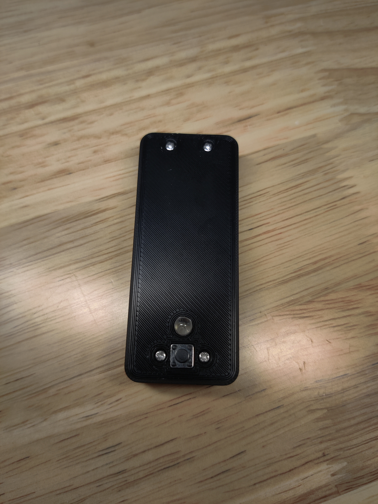
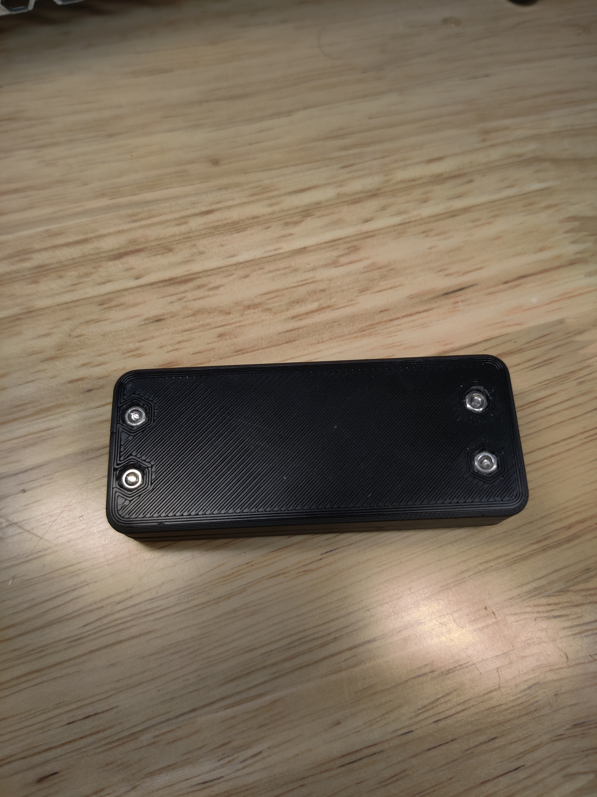

# pico_keep_awake
pi pico project that keeps a computer awake by sending HID commands every mintue

## Install Instructions:

  1. Download or clone down this repo `git clone git@github.com:Asherza/pico_keep_awake.git `

  2. Download CircuitPython from `https://circuitpython.org/board/raspberry_pi_pico/`

  3. Copy the .uf2 into the root of your pi pico

  4. Copy code.py into your pi pico

  5. Navigate to your cloned repo and create a venv `python3 -m venv venv`

  6. Activate your venv `./venv/bin/activate` or `source ./venv/Scripts/activate`

  7. install circup `pip install circup`

  8. run circup to install all required packages: `circup install --auto`

  9. You now should be good to go!

## Printing info
3D printing these STL's should be very easy, nothing is too challenging on the print.

You may want to create some supports for the usb hole, but it should be fine if you have your bridges tuned in.

## Required components

- Two resistors
    - I used a 330 ohm for my LED
    - I used a 10k ohm for my pull down

- A standard 5mm blue LED
- A 6x6x5 tactil push button
- 4x M2x12 screws
- 4x M2 nuts

## Required tools

- Glue gun / glue sticks
- M2 hex key

## Build Instructions

- Coming soon!

